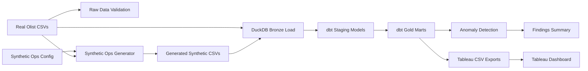
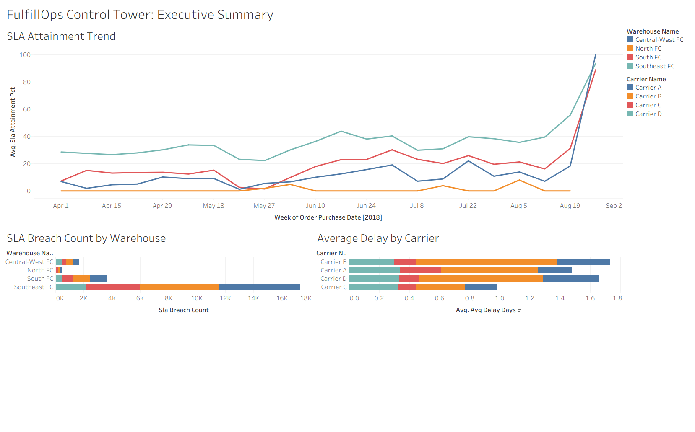
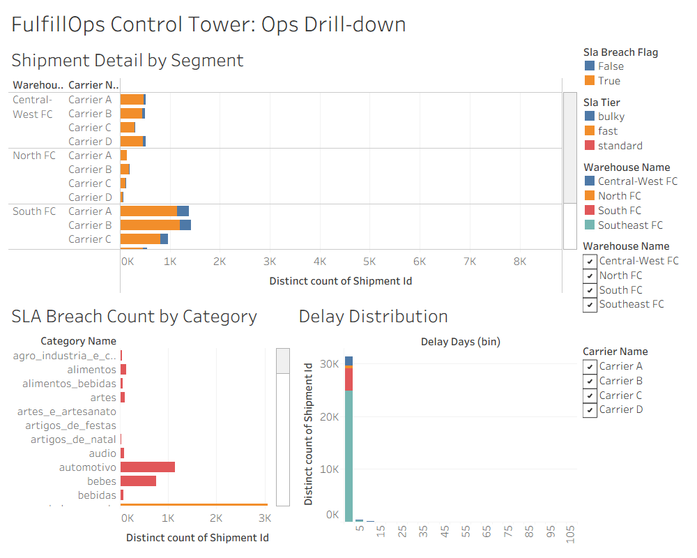
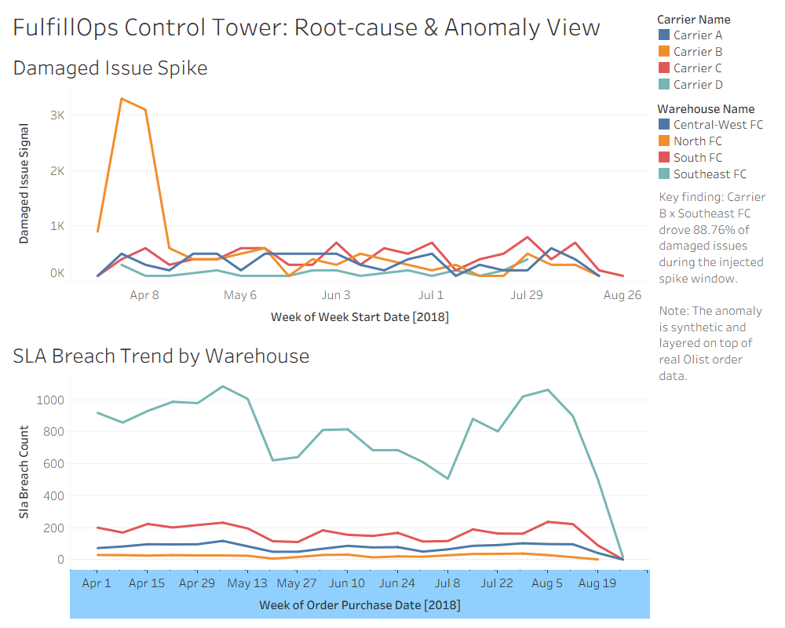

# FulfillOps Control Tower

FulfillOps Control Tower is an end-to-end analytics engineering portfolio project for monitoring ecommerce fulfillment performance, SLA risk, carrier quality, and operational anomalies.

## Business Problem

Fulfillment teams need a reliable way to see where delivery promises are being missed, which warehouse-carrier segments are driving exceptions, and whether emerging issue patterns deserve investigation. Raw order data alone does not usually contain the operational context needed for this kind of control tower, so this project layers a synthetic operations model on top of real ecommerce orders.

## Why This Project Matters

This project demonstrates a realistic analytics workflow: raw data validation, reproducible synthetic operations generation, DuckDB warehousing, dbt staging and marts, data-quality tests, anomaly validation, Tableau-ready exports, and dashboard documentation. It is designed to show the judgment needed for operational analytics: preserving data lineage, separating real signals from synthetic assumptions, and making findings interview-friendly without overstating them.

## Data Sources

- Real source data: Brazilian E-Commerce Public Dataset by Olist.
- Synthetic operational layer: warehouses, carriers, SLA targets, issue flags, and injected anomaly windows generated for this project.
- Important distinction: Olist order, customer, product, review, seller, payment, and geolocation files are real public ecommerce data. Warehouse, carrier, SLA, issue, and anomaly fields are synthetic. The anomalies are injected validation events, not real Olist business incidents.

## Architecture



## Data Model

The DuckDB warehouse uses a bronze, staging, and gold structure.

- Bronze tables preserve raw field names from Olist and generated synthetic CSVs.
- Staging models clean and join operational context into `stg_orders`, `stg_shipments`, and `stg_issues`.
- Gold marts include `fct_shipments`, `dim_warehouse`, `dim_carrier`, `dim_category`, `dim_date`, `agg_daily_sla_performance`, and `agg_weekly_quality_by_segment`.
- Tableau exports are written to `dashboard/exports/` from the gold marts.

## KPIs

- Shipment count
- SLA attainment %
- SLA breach count
- On-time delivery %
- Average delay days
- Quality issue rate %
- Damaged issue rate
- Flagged anomaly segment-weeks

## Anomaly Detection

The anomaly workflow scores weekly warehouse-carrier segment behavior with two detection tracks:

- SLA breach-rate detection catches delivery and SLA drift using a trailing four-week baseline.
- Damaged issue-rate detection catches quality spikes that may not affect delivery timing.

Both tracks use z-scores and minimum-volume rules, then compare detected segment-weeks against known injected anomaly labels only after scoring.

## Key Finding

Carrier B x Southeast FC drove 88.76% of damaged issues during the injected spike window.

During that window, the segment had a 30.04% damaged issue rate, compared with 0.95% for the same segment outside the spike window. This is a synthetic operational anomaly layered on real Olist order volume, not a real Olist incident.

## Dashboard Screenshots

### Executive Summary



### Ops Drill-down



### Root-cause Anomaly View



## How To Run Locally

Place the Olist CSV files in `raw/olist/`, then run:

```text
python scripts/validate_raw_olist.py
python scripts/generate_synthetic_ops.py
python scripts/load_bronze_duckdb.py
cd transform
dbt build --profiles-dir .
cd ..
python scripts/detect_anomalies.py
python scripts/summarize_anomaly_findings.py
python scripts/export_tableau_datasets.py
```

Open `dashboard/fulfillops_control_tower.twb` in Tableau and connect to the curated CSV exports in `dashboard/exports/`.

## dbt Tests And CI

The dbt project includes source, staging, mart, relationship, uniqueness, accepted-values, and custom date-ordering tests. A full local dbt build has passed with 47 total dbt steps.

GitHub Actions CI is configured and passing for the committed checks. Because raw Olist CSVs and DuckDB database files are intentionally not committed, CI runs the full rebuild/dbt/anomaly path only when those raw Kaggle files are available in `raw/olist/`.

## Snowflake Validation Status

Snowflake validation is prepared and documented in `docs/snowflake_validation.md`, with a placeholder dbt profile at `transform/profiles_snowflake.yml.example`. DuckDB remains the local development warehouse. Snowflake validation has not been executed unless credentials and Snowflake objects are configured locally.

## Limitations

- The operational layer is synthetic and should be treated as a controlled analytics scenario, not a claim about Olist's real logistics operations.
- Raw Olist CSVs are not committed because they are large source files.
- `warehouse/fulfillops.duckdb` is generated locally and not committed.
- The Tableau Public link is not included yet.
- The SLA drift finding should be interpreted as a synthetic validation signal; the current generated start/end warehouse breach rates are nearly flat.
- CI cannot fully rebuild the warehouse without the raw Olist files.

## Repo Structure

```text
fulfillops-control-tower/
|-- dashboard/
|   |-- exports/
|   |-- screenshots/
|   |-- fulfillops_control_tower.twb
|   |-- README.md
|   `-- tableau_build_guide.md
|-- docs/
|   |-- anomaly_detection_notes.md
|   |-- anomaly_findings.md
|   |-- dbt_docs_notes.md
|   `-- snowflake_validation.md
|-- raw/
|   |-- olist/
|   `-- synthetic/
|-- scripts/
|-- transform/
|   |-- models/
|   |   |-- staging/
|   |   `-- marts/
|   |-- dbt_project.yml
|   |-- profiles.yml
|   `-- profiles_snowflake.yml.example
|-- warehouse/
|-- .github/workflows/ci.yml
|-- .env.example
|-- .gitignore
|-- README.md
`-- requirements.txt
```
